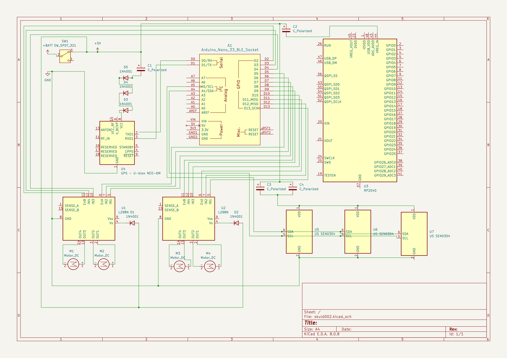

# SKU LD002

# Bill Of Materials

## Chassis

#### Specifications:
- Branch: Protech
- Robot height: 2.6 in (6.5 cm)
- Weight: 1.68 lb. (760 g)
- Chassis length: 8.3 in (21 cm)
- Chassis height: 2.6 in (6.5 cm)

## TT Motors x 4
#### Specifications

- Gear ratio 1:48
- No-load speed: 220rpm
- Torque (3V): 3200 mg/cm
- Torque (6V): 5500 mg/cm

## Mecanum Wheels

- Brand: DF Robot
[Datasheet](https://core-electronics.com.au/mecanum-wheel-left-80mm.html)

## Wheel Shaft

- Brand Ryder Robots

see [wheel shaft](wheel_shaft.md)

## Raspberry Pi 4B

[Datasheet](https://datasheets.raspberrypi.com/rpi4/raspberry-pi-4-datasheet.pdf)

## SEN0304 x 3
[Datasheet](https://www.mouser.com/pdfDocs/ProductOverview_DFRobot_SEN0304.pdf)

- range  150cm, 300cm, 500cm (selectable)
- voltage 3.3v or 5.5 DC
- resolution 1cm (increments)
- 20mA operating current

## U-blox NEO-6M Compatible GPS Module

[datasheet](https://content.u-blox.com/sites/default/files/products/documents/NEO-6_DataSheet_%28GPS.G6-HW-09005%29.pdf)

- voltage 3.3v
- current 10mA

[see GPS](gps.md)

# Logical Wiring

Logical wiring, is all wiring that does not involve power, 

## H-Bridge

Diodes are placed in front of H-bridge Vs line to stablalize current.

### H-bridge 1

| Hbridge | MC GPIO | 
|---------|---------|
| ENB     | D2      |
| IN4     | D3      |
| IN3     | D4      |
| ENA     | D5      |
| IN2     | D6      |
| IN1     | D7      |

### H-bridge 2

| Hbridge | MC GPIO    | 
|---------|------------|
| ENB     | D8         |
| IN4     | D9         |
| IN3     | D10        |
| ENA     | D11 (MOSI) |
| IN2     | D12 (MISO) |
| IN1     | D13 (SCK)  |

## GPS

| IO | MC GPIO |
| -- |---------|
| TX | RX      |
| RX | TX      |

3 diodes in serial are used to reduce voltage from 5v to 3v, Note that current may need to be 
controlled (not decided yet). Polarized capacitor is placed in front of GPS so that power 
is available

# Ultra Sonic

All ultra sonics are on a serial bus, two capacitors are used in parallel to achieve capacitance 
as close as possible to 438 $\my F$

Bus lines are I2C SDA, SCL and are connected to micro-processor.

# Circuit Board Notes

For current calculation, the formula is $R = \frac{V}{I_m}$

where:
- R = resistance measured in Ohms
- V = voltage measured in volts
- I = current measured in Amps

For ultra-sonics the calculation becomes:

$R = \frac{V}{3I_m}$

the coefficients being the 3 SEN0304.

$R = \frac{3.3}{3(20 \times 0.001)} = \frac{3.3}{3(20 \times 0.001)} = \frac{3.3}{0.06} = 55\Omega$ 

therefore the capacitor required is:

$V(t) = V_0 \times e ^ \frac{t}{RC}$

Where:
- V(t) = Voltage at time  3.3v
- V₀ = Initial voltage 3.3v
- R = Resistance (55 $\Omega$)
- C = Capacitance
- t = Time (10ms = 0.01s)

becomes

$C = - \frac{0.01}{55(-0.415)} \approx 438 \mu F$

# References

[Arduino 33 BLE Pins](https://axodyne.com/2020/06/arduino-33-ble-pins/)

